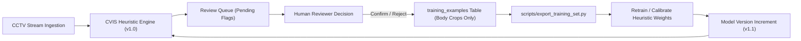

# CVIS Active Learning & Continuous Model Calibration Guide

## 1. Overview

Campus Vision Intelligence System (CVIS) incorporates an **Active Learning Feedback Loop** to ensure continuous improvement of clothing heuristic classifiers while preserving rigorous privacy boundaries.

Whenever human reviewers make determinations in the Compliance Review Queue (confirm, reject, or dismiss), high-value training samples are automatically registered in the system's active learning repository (`training_examples`).

---

## 2. Strict Privacy Architecture

To adhere to university ethics policies and international privacy regulations:

1. **Body Crops Only**:
   - Only torso/waist/body crops (`body_crop_ref`) are captured in the training repository.
   - **Student face crops are strictly prohibited** from entering the active learning dataset.
2. **PII Isolation**:
   - Training manifests contain no roll numbers, student names, or student database IDs.
   - Labels consist strictly of `{violation_type, is_violation, rejection_reason}`.
3. **Audit Trail**:
   - The reviewer ID and timestamp are logged to maintain dataset provenance and traceability.

---

## 3. Data Schema & Collection Trigger

When a reviewer executes an action via the API:
- `POST /api/v1/reviews/flags/{flag_id}/confirm`:
  - `is_violation = True`
  - `rejection_reason = None`
- `POST /api/v1/reviews/flags/{flag_id}/reject`:
  - `is_violation = False`
  - `rejection_reason = <TypedRejectionReason>` (e.g. `false_positive_clothing`, `lighting_contrast_artifact`)
- `POST /api/v1/reviews/flags/{flag_id}/dismiss`:
  - `is_violation = False`
  - `rejection_reason = no_violation_found`

Each entry captures the active `model_version` (e.g. `cvis-dresscode-v1.0`) to benchmark performance across model generations.

---

## 4. Exporting the Training Dataset

Administrators or ML engineers can extract the accumulated dataset using the dedicated export utility:

```bash
python scripts/export_training_set.py
```

### Output Artifacts
The export script packages files into `exports/training_dataset/`:
- `images/`: Cropped JPEG images named by `example_id.jpg`.
- `manifest.csv`: Standardized metadata table:

| Column | Description |
| :--- | :--- |
| `example_id` | Unique UUID for the training sample |
| `flag_id` | Originating compliance flag ID |
| `image_filename` | Reference to file in `images/` |
| `violation_type` | Targeted dress-code heuristic (e.g. `untucked_shirt`) |
| `is_violation` | Boolean label (`True` = confirmed, `False` = rejected) |
| `rejection_reason` | Granular root cause for false positives |
| `model_version` | Model version active when sample was recorded |
| `created_at` | Timestamp of labeling |

---

## 5. Continuous Retraining Lifecycle



### Calibration Workflow:
1. **Accumulate Samples**: Allow reviewer queue to process flags across varying campus lighting conditions and semesters.
2. **Segment Inspection**: Cross-reference high-FPR cameras from the **Telemetry Dashboard** to identify optical distortions or shadows.
3. **Weight Calibration**: Update waistband Sobel gradient thresholds, HSV lower-hem dispersion parameters, or collar contour kernels in `ml-service/app/core/heuristics.py`.
4. **Benchmark Verification**: Run `tests/test_face_core.py` and regression benchmarks before deploying the new version.
