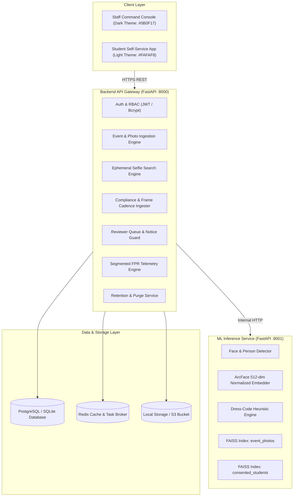
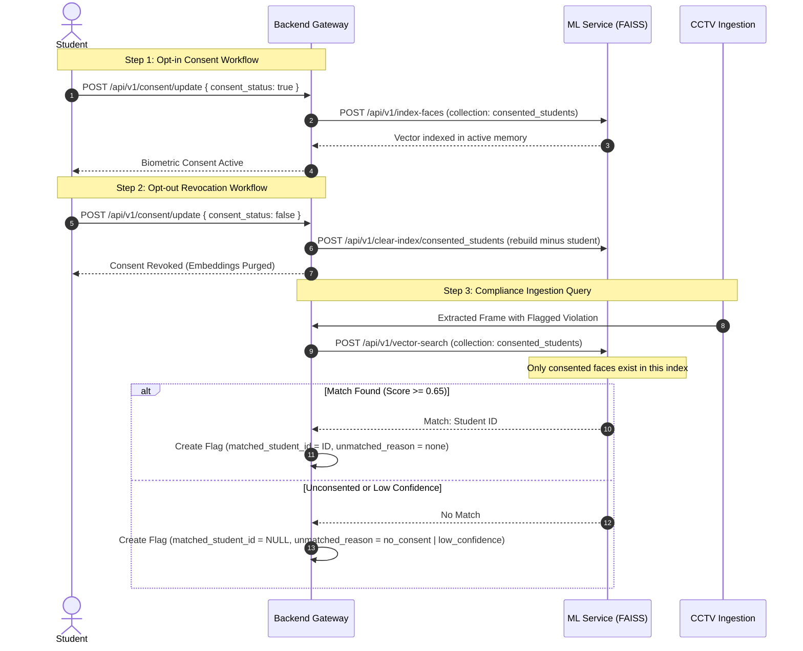

# CVIS — System Architecture & Design Specification

## 1. Executive Architecture Summary

The **Campus Vision Intelligence System (CVIS)** is an enterprise university computer-vision platform composed of two decoupled functional subsystems powered by a shared, CPU-optimized face recognition and vector search core:

```
                               ┌─────────────────────────────────────────┐
                               │           Shared Biometric Core         │
                               │  - Face Detection (YuNet / Multi-scale) │
                               │  - 512-dim Embeddings (ArcFace / L2)    │
                               │  - Vector Indexing (FAISS / Cosine IP)  │
                               └────────────────────┬────────────────────┘
                                                    │
                 ┌──────────────────────────────────┴──────────────────────────────────┐
                 ▼                                                                     ▼
┌─────────────────────────────────┐                                 ┌─────────────────────────────────────┐
│  Subsystem A: Event Photo Finder│                                 │ Subsystem B: Compliance Review      │
│  - Self-Service Student Search  │                                 │ - Cadence CCTV Frame Ingestion      │
│  - Multi-Face Album Ingestion   │                                 │ - Dress-Code Heuristic Classifier   │
│  - Ephemeral Memory Processing  │                                 │ - Pre-Search Consent Isolation      │
│  - Strict Rate Limiting         │                                 │ - Strict Human-in-the-Loop Queue    │
│  - No Student Data Retention    │                                 │ - Draft-and-Send Disciplinary Guard │
└─────────────────────────────────┘                                 └─────────────────────────────────────┘
```

---

## 2. Microservice Boundaries



---

## 3. Pre-Search Consent Isolation Architecture

A core privacy guarantee of CVIS is that unconsented individuals are not merely filtered out *after* vector matching; rather, **unconsented faces never enter the search comparison at all**.



---

## 4. Human-in-the-Loop Disciplinary Guard

Under no circumstances does CVIS dispatch automated disciplinary notices.

1. **State 1: AI Detection**: Frame violation detected $\rightarrow$ Flag created with `status = PENDING`.
2. **State 2: Reviewer Inspection**: Staff inspects side-by-side face comparison and heuristic breakdown.
3. **State 3: Human Verdict**:
   - If confirmed $\rightarrow$ `status = CONFIRMED`, `reviewed_by = reviewer_id`.
   - If rejected $\rightarrow$ `status = REJECTED`, `rejection_reason = typed_enum` (feeds telemetry).
4. **State 4: Draft & Send**:
   - Reviewer drafts a formal advisory.
   - Reviewer explicitly clicks "Approve & Dispatch Notice".
   - System automatically sets `is_retained_case = true`, protecting the record from scheduled purges.

---

## 5. Multi-Dimensional FPR Telemetry

Reviewer rejections feed an analytical engine that isolates model accuracy from hardware/environmental faults:

$$\text{FPR}_{\text{global}} = \frac{\sum \text{Rejected Flags}}{\sum \text{Reviewed Flags}} \times 100$$

$$\text{FPR}_{c, v} = \frac{\text{Rejected Flags for Camera } c, \text{ Violation } v}{\text{Total Reviewed Flags for Camera } c, \text{ Violation } v} \times 100$$

### Statistical Significance Threshold ($N \ge 10$)
If a camera exhibits an $\text{FPR} \ge 35\%$ with `lighting_contrast_artifact` as the leading rejection reason, the Ops Console highlights the sensor with an **"Environmental Calibration Recommended"** tag, provided $N \ge 10$. This guarantees small-sample outliers (e.g. 1 rejection out of 2 reviews) do not trigger false alerts.
