# Campus Vision Intelligence System (CVIS)
## Institutional Data Protection & Compliance Architecture

*Audience: University Administration, Legal Counsel, Ethics Committees, and Data Protection Officers (DPO).*

---

## 1. Executive Summary & Purpose

The **Campus Vision Intelligence System (CVIS)** is an AI-assisted computer vision platform designed specifically for collegiate campus environments. Unlike commercial facial recognition products that operate as continuous mass-surveillance networks, CVIS was designed from inception around the principle of **Defensive Privacy by Design**.

CVIS bifurcates all visual operations into two distinct, decoupled subsystems:
1. **Subsystem A: Event Photo Finder** — A self-service, opt-in photo discovery tool for campus life, student gatherings, and convocations.
2. **Subsystem B: Compliance Monitoring** — A bounded, cadence-sampled compliance assistant that assists human review staff with dress-code and ID-badge policies.

```mermaid
flowchart TD
    subgraph Privacy_Boundary["Cryptographic & Architectural Privacy Boundary"]
        A["Student Body"] -->|"Explicit Consent"| B["Consented Vector Index (Partitioned)"]
        A -->|"No Consent / Opt-Out"| C["Zero Ingestion / Zero Biometric Retention"]
    end
    subgraph Subsystems["Decoupled Workflows"]
        B -.->|"Pre-Filtered Candidate Match"| D["Human Reviewer Queue"]
        D -->|"Mandatory Review & Confirmation"| E["Human-Drafted Notice"]
        E -->|"Secondary Human Approval"| F["Notice Dispatch to Student"]
        G["Event Photo Dumps"] --> H["Ephemeral Ephemeral Query (Selfie Never Stored)"]
    end
    style Privacy_Boundary fill:#131A26,stroke:#3DA9FC,stroke-width:2px
    style Subsystems fill:#0B0F17,stroke:#232C3D,stroke-width:1px
```

---

## 2. Core Legal & Compliance Guarantees

### Guarantee 1: Pre-Search Consent Gating (Zero Negative Matching)
- Under GDPR Article 9 (Special Category Data) and international privacy frameworks, biometric templates may not be processed without explicit consent.
- In CVIS, vector similarity matching runs exclusively against a dedicated partition: `consented_students`.
- **Pre-Search Guarantee**: Students who have not consented are not matched and subsequently filtered; rather, **their mathematical embeddings are never introduced into the searchable compliance index**.
- When an unconsented student appears in video footage, CVIS outputs an explicit `unmatched_reason = no_consent` flag with **zero PII and null student IDs**.

### Guarantee 2: Prohibition of Autonomous Disciplinary Action
- Article 22 of the GDPR grants individuals the right not to be subject to decisions based solely on automated processing.
- CVIS strictly enforces this via a dual-gated schema:
  - **No automated notices**: The machine vision service cannot generate, send, or dispatch emails, SMS, or disciplinary notices.
  - **Two-person human guard**: A compliance flag must first be confirmed by a human reviewer. A notice must then be individually drafted and separately dispatched by an authorized officer (`drafted_by` and `sent_by` recorded as distinct audit entries).

### Guarantee 3: Ephemeral Self-Service Event Search
- When a student or visitor uploads a selfie to find photos from campus events:
  - The uploaded selfie is stored strictly in ephemeral memory (`/tmp` or RAM) for the duration of vector extraction.
  - As soon as the 512-dimensional vector is queried against the event dump, the source selfie file is deleted immediately.
  - The query vector is never appended to any permanent student profile or index.

### Guarantee 4: 30-Day Retention Schedule & Automated Purge
- Raw CCTV recordings and unconfirmed compliance flags are retained for a rolling maximum of 30 days.
- A daily automated purge worker executes:
  $$\text{Purge} = \{ f \in \text{Flags} \mid \text{age}(f) > 30\text{ days} \land \neg f.\text{is\_retained\_case} \}$$
- Only cases where a notice was reviewed and formally dispatched are tagged `is_retained_case = True` for institutional record-keeping.

### Guarantee 5: Immutable Cryptographic Audit Log
- Every read, write, consent toggle, review decision, notice approval, and purge operation records a permanent row in the `audit_logs` table.
- Audit logs contain the actor identity, role, timestamp, target entity, and detailed metadata.
- Audit records have no deletion or update endpoints and persist indefinitely for accreditation and compliance reviews.

---

## 3. Regulatory Alignment Matrix

| Regulation / Standard | Requirement | CVIS Architectural Control |
| :--- | :--- | :--- |
| **GDPR Art. 9** | Biometric data processing prohibition | Opt-in consent gating; Pre-search partition index isolation. |
| **GDPR Art. 17** | Right to erasure ("Forgotten") | One-click consent revocation instantly removes vectors from index and disk. |
| **GDPR Art. 22** | Safeguards against automated decisions | Mandatory human review; dual-step notice dispatch; automated notices physically impossible. |
| **FERPA** | Protection of student educational records | Encrypted database storage, role-based access control (RBAC), immutable access auditing. |
| **ISO/IEC 27001** | Segregation of duties & access control | 4 distinct roles: Student, Reviewer, Event Staff, and System Admin. |

---

## 4. Oversight & Transparency Tools for DPOs

1. **Live Consent Registry**: Institutional DPOs can inspect total consent counts, revocation histories, and enrollment timelines in real time.
2. **Telemetry Dashboard**: System displays real-time False-Positive Rates (FPR) across heuristic types and individual camera sensors, guarded by minimum sample size thresholds ($N \ge 15$).
3. **Audit Log Viewer**: Full chronological log with actor tracking, searchable by target entity and action type.
4. **On-Demand Purge**: Administrative trigger allowing compliance officers to verify and execute data retention purges on demand.
